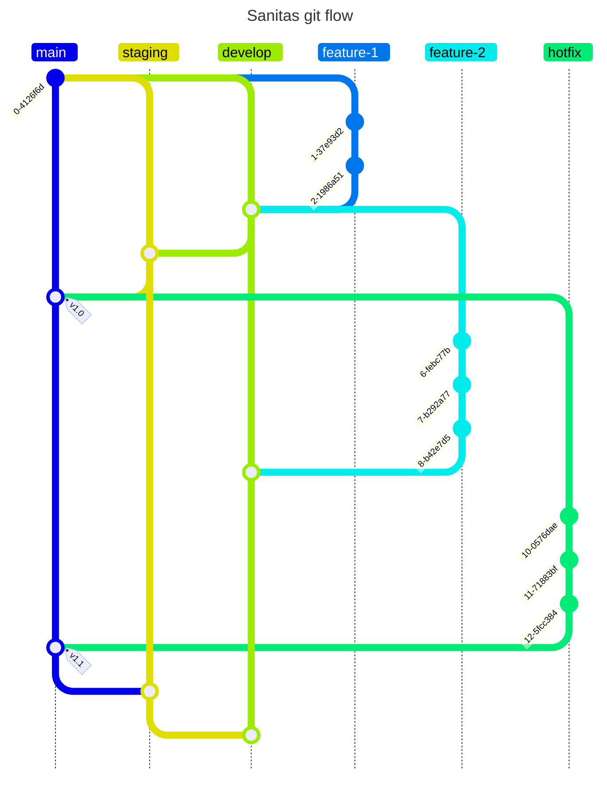

# Metodología de desarrollo

La metodología de desarrollo que se utilizó dentro de este repositorio está
basada en [Github Flow](https://docs.github.com/en/get-started/using-github/github-flow).

Básicamente se tiene una rama `main` en donde se encuentra solamente código en
producción, luego una rama `develop` en donde se encuentra la versión de
desarrollo, en cierta forma sería el canal `canary` de Sanitas. Además se tiene
una rama `staging` principalmente usada para beta testear código antes de darle
merge a `main`.

Cada `feature` que agreguemos será desarrollada en su propia rama y únicamente
será unido a `develop` por medio de una Pull Request.
`develop`, `main` y `staging` no aceptan cambios por si mismas,
solo se pueden realizar cambios usando una Pull Request.

Debido a la gran cantidad de PRs que se pueden generar al momento de usar esta
metodología y debido a que este es un monorepo se decidió designar encargados
según el área de trabajo, estas personas son las principales responsables de
hacer review a las PRs en cada una de estas áreas:

- Database: [@BiancaCalderon](https://github.com/BiancaCalderon), [@XavierLopez25](https://github.com/XavierLopez25)
- Backend: [@ElrohirGT](https://github.com/ElrohirGT)
  y [@DanielDubon](https://github.com/DanielDubon)
- Nix env: [@ElrohirGT](https://github.com/ElrohirGT) y [@DanielDubon](https://github.com/DanielDubon)
- Frontend: Visual & UI/UX Review por [@lemoonchild](https://github.com/lemoonchild)
  , Code Structure Review por [@XavierLopez25](https://github.com/XavierLopez25)
- Wiki: [@BiancaCalderon](https://github.com/BiancaCalderon)
- CI/CD: [@ElrohirGT](https://github.com/ElrohirGT), [@XavierLopez25](https://github.com/XavierLopez25)

La persona que crea la PR es la responsable de darle merge dentro del repositorio.
Al momento de mergear una PR por favor seleccionar la opción `squash and merge`.

Cualquiera del equipo puede contribuir y ayudar a mejorar Sanitas!

Para contribuir puedes leer nuestra [Guía de Contribución](Guia_de_contribuci%C3%B3n.md)

El siguiente diagrama ilustra un poco el estado
y la relación de las ramas entre sí:

Para los commits se utilizará el formato de [Conventional Commits](https://www.conventionalcommits.org/en/v1.0.0/).

A continuación se explican la mayoría de tags que se utilizarán:

- refactor: No se agregó ninguna funcionalidad nueva al repositorio ni tampoco
  se arregló un bug, simplemente se refactorizó algo para hacerlo más mantenible.
- docs: Se arregló/agregó algo de la wiki o comentarios de documentación.
- chore: Representa una tarea extra que no añade nada de valor al repo, por
  ejemplo formatear código.
- fix: Se arregló algo dentro del proyecto.
- feat: Se agregó algo nuevo al proyecto.

## Formatos de las PRs

Las PRs deben seguir el formato de [Conventional Commits](https://www.conventionalcommits.org/en/v1.0.0/),
tu checklist es la siguiente por cada PR:

- Asignate a tí mismo dentro de la PR.
- Asegúrate que el nombre de la PR siga el formato de [Conventional Commits](https://www.conventionalcommits.org/en/v1.0.0/).
- Añade una breve descripción de la escencia de tus cambios en tu PR.
- Agrega el link al issue de ClickUp.
- Asegurate que la PR pase todos los chequeos de CI.
- Ponle las tags correspondientes a tu PR.
  - **Backend**: PRs que modifican lógica relacionada al backend.
  - **Frontend**: PRs que modifican lógica relacionada al frontend.
  - **Database**: PRs que modifican lógica relacionada a la base de datos.
  - **Wiki**: PRs que editan la wiki.
  - **Nix**: PRs que modifican el entorno de desarrollo en Nix.
  - **CI/CD**: PRs relacionadas con la CI/CD pipeline.

Una vez cumplas todos los requerimientos de arriba puedes pedir una review
para tu PR al mantenedor de tu área correspondiente!
