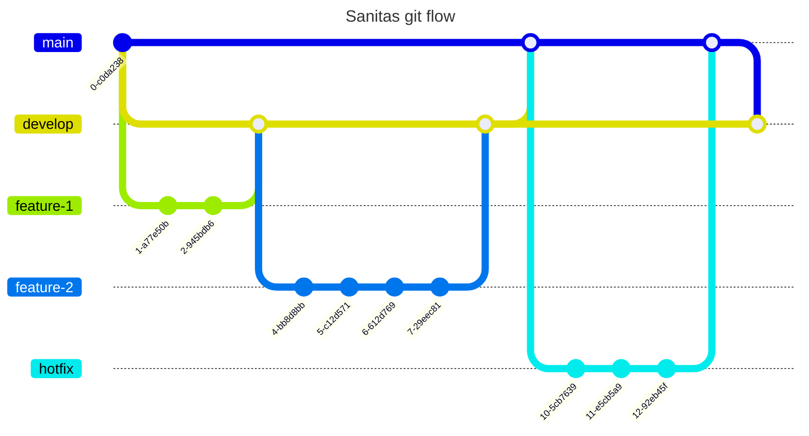

# Metodología de desarrollo
La metodología de desarrollo que se utilizó dentro de este repositorio está basada en [Github Flow](https://docs.github.com/en/get-started/using-github/github-flow).

Básicamente se tiene una rama `main` en donde se encuentra solamente código en producción, luego una rama `develop` en donde se encuentra la versión de desarrollo, en cierta forma sería el canal `canary` de Sanitas.

Cada `feature` que agreguemos será desarrollada en su propia rama y únicamente será unido a `develop` por medio de una Pull Request, tanto `develop` como `main` no aceptan cambios por si mismas, solo se pueden realizar cambios usando una Pull Request.

Debido a la gran cantidad de PRs que se pueden generar al momento de usar esta metodología y debido a que este es un monorepo se decidió designar encargados según el área de trabajo, estas personas son las únicas con permiso de darle merge a las PRs en cada una de estas áreas:

- Database: [@BiancaCalderon](https://github.com/BiancaCalderon)
- Backend: [@ElrohirGT](https://github.com/ElrohirGT)
- Nix env: [@ElrohirGT](https://github.com/ElrohirGT)
- Frontend: Visual & UI/UX Review por [@lemoonchild](https://github.com/lemoonchild) , Code Structure Review por [@XavierLopez25](https://github.com/XavierLopez25)
- Wiki: [@BiancaCalderon](https://github.com/BiancaCalderon)

El siguiente diagrama ilustra un poco el estado y la relación de las ramas entre sí:

Para los commits se utilizará el formato de [Conventional Commits](https://www.conventionalcommits.org/en/v1.0.0/).

## Formatos de las PRs
Las PRs deben seguir el formato de [Conventional Commits](https://www.conventionalcommits.org/en/v1.0.0/), tu checklist es la siguiente por cada PR:

- Asignate a tí mismo dentro de la PR.
- Asegúrate de que el nombre de la PR sea una que siga el formato de [Conventional Commits](https://www.conventionalcommits.org/en/v1.0.0/).
- Añade una breve descripción de la escencia de tus cambios en tu PR.
- Agrega el link al issue de ClickUp.
- Asegurate que la PR pase todos los chequeos de CI.
- Ponle las tags correspondientes a tu PR.
    - **Backend**: PRs que modifican lógica relacionada al backend.
    - **Frontend**: PRs que modifican lógica relacionada al frontend.
    - **Database**: PRs que modifican lógica relacionada a la base de datos.
    - **Wiki**: PRs que editan la wiki.
    - **Nix**: PRs que modifican el entorno de desarrollo en Nix.
    - **CI/CD**: PRs relacionadas con la CI/CD pipeline.

Una vez cumplas todos los requerimientos de arriba puedes pedir una review para tu PR al mantenedor de tu área correspondiente! 
