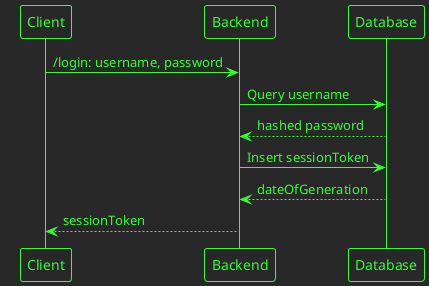

# Mantenimiento de Sanitas
Bienvenido a la wiki para darle mantenimiento a Sanitas! Puedes ver un ejemplo de una request de login en el siguiente diagrama de secuencia:

```plantuml
@startuml
!theme crt-green

Client -> Backend: /login: username, password

Backend -> Database: Query username
Database --> Backend: hashed password

Backend -> Database: Insert sessionToken
Database --> Backend: dateOfGeneration

Backend --> Client: sessionToken

@enduml
```
