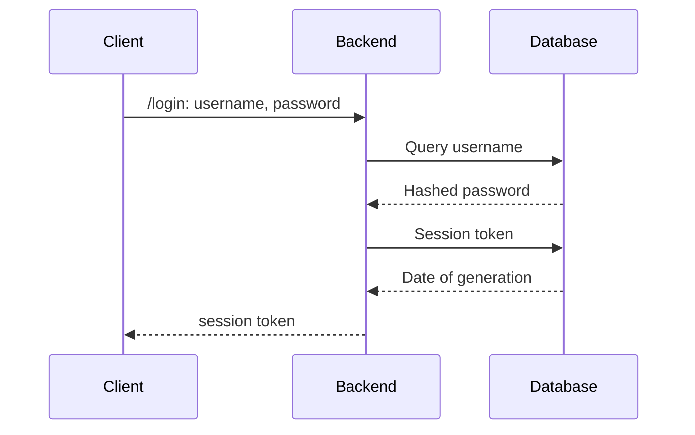

# Mantenimiento de Sanitas

Bienvenido a la wiki para darle mantenimiento a Sanitas!
Puedes ver un ejemplo de una request de login en el siguiente diagrama de secuencia:

Si quieres consulta nuestra [Metodología de Desarrollo](./Metodologia_de_desarrollo.md)

## Base de datos

Para la base de datos se decidió utilizar [PostgreSQL](https://www.postgresql.org/).
Para más información consulta [nuestra guía a los datos](./db/README.md)
