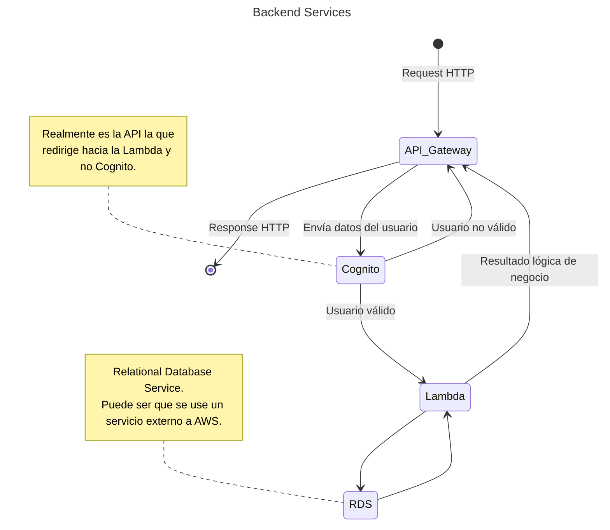

# Sanitas Backend

El backend de sanitas es una REST API que utiliza una arquitectura de microservicios,
se utilizaron varios servicios de Amazon como lo son lambdas, api gateway,
cognito y demás. La relación entre estos servicios los ilustra el diagrama:



El _lifecycle_ de una request es el siguiente:

1. API Gateway recibe la request y envía los datos a Cognito.
1. Cognito evalúa si los datos enviados pertenecen a un usuario autenticado o
   capaz de autenticarse.
   - En caso el usuario no sea autenticable, API Gateway rechaza la request.
   - En caso el usuario sí sea autenticable, API Gateway acepta la request y
     envía la data a la Lambda correspondiente.
1. Lambda evalúa los datos de la request y ejecuta la lógica de negocio
   correspondiente.
1. Lambda envía su resultado a API Gateway.
1. API Gateway responde según el estatus dado por la Lambda.

Este proyecto utiliza [AWS SAM](https://aws.amazon.com/serverless/sam/), el
framework oficial de parte de AWS para manejar aplicaciones serverless dentro de
su plataforma.

## Desarrollo local

SAM utiliza un archivo llamado `template.yaml` para definir todos los recursos
dentro de la consola AWS que necesita el proyecto para funcionar. El formato de
las definiciones y todos los tipos y valores que existen se encuentran en [la especificación](https://docs.aws.amazon.com/serverless-application-model/latest/developerguide/sam-specification.html).

Si no utilizaste Nix, necesitas instalar las siguientes dependencias dentro de
tu sistema:

- [nodejs 20](https://nodejs.org/en)
- [aws-cli](https://aws.amazon.com/cli/)
- [sam-cli](https://docs.aws.amazon.com/serverless-application-model/latest/developerguide/install-sam-cli.html)
- [docker](https://www.docker.com/) (SAM lo utiliza para desarrollo local)

Recuerda configurar las credenciales de AWS con las credenciales que vas a usar
para desarrollo.

Para correr el proyecto de forma local recuerda hacer `npm install`. De forma
adicional por favor ingresa al directorio de `sanitas_backend/layers` y haz
`npm install` por cada paquete que se encuentre ahí.

Finalmente realiza `sam local start-api` para correr la API de forma local en
`localhost:3000`.

## Testing

Todos los handlers de las lambdas se encuentran dentro del directorio
`src/handlers`. Cada lambda tiene dentro de su propio directorio las unit test e
integration tests definidas para ella.

Una **Unit Test** prueba funciones pequeñas de lógica de negocio dentro de la
aplicación, mientras que la **Integration Test** necesita que la API esté corriendo
de forma local para ejecturase. Ambas tests se corren utilizando el comando:

```bash
npm test
```
