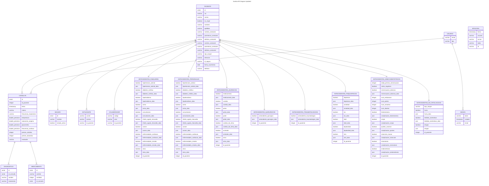

# Base de Datos

La base de datos para Sanitas es una de tipo relacional programada en postgres,
el diagrama ER de esta es el siguiente:

```mermaid
---
title: Sanitas ER Diagram Updated
---
erDiagram
    PACIENTE {
        serial id
        varchar cui
        varchar correo
        boolean es_mujer
        varchar nombres
        varchar apellidos
        varchar nombre_contacto1
        varchar parentesco_contacto1
        varchar telefono_contacto1
        varchar nombre_contacto2
        varchar parentesco_contacto2
        varchar telefono_contacto2
        varchar tipo_sangre
        varchar direccion
        varchar id_seguro
        date    fecha_nacimiento
        varchar telefono
    }

    CONSULTA {
        serial      id
        integer     id_paciente
        timestamp   fecha
        varchar     motivo
        varchar     frecuencia_respiratoria
        double_precision temperatura
        double_precision     saturacion_oxigeno
        double_precision     glucometria
        double_precision     frecuencia_cardiaca
        integer presion_sistolica
        integer presion_diastolica
        varchar evaluador
    }

    DIAGNOSTICO {
        serial  id
        serial  id_consulta
        varchar nombre
        varchar tratamiento
    }

    MEDICAMENTO {
        serial      id
        varchar     nombre
        integer     cantidad
        serial      id_consulta
    }

    SEGURO {
        serial  id
        varchar nombre
        boolean estado_activo
    }

    ESTUDIANTE {
        varchar carnet
        varchar carrera
        varchar id_paciente
    }

    COLABORADOR {
        varchar codigo
        varchar area
        varchar id_paciente
    }

    ANTECEDENTES_FAMILIARES {
        boolean hipertension_arterial
        json hipertension_arterial_data
        boolean diabetes_mellitus
        json diabetes_mellitus_data
        boolean hipotiroidismo
        json hipotiroidismo_data
        boolean asma
        json asma_data
        boolean convulsiones
        json convulsiones_data
        boolean infarto_agudo_miocardio
        json infarto_agudo_miocardio_data
        boolean cancer
        json cancer_data
        boolean enfermedades_cardiacas
        json enfermedades_cardiacas_data
        boolean enfermedades_renales
        json enfermedades_renales_data
        boolean otros
        json otros_data
        integer id_paciente
    }

    ANTECEDENTES_PERSONALES {
        boolean hipertension_arterial
        json hipertension_arterial_data
        boolean diabetes_mellitus
        json diabetes_mellitus_data
        boolean hipotiroidismo
        json hipotiroidismo_data
        boolean asma
        json asma_data
        boolean convulsiones
        json convulsiones_data
        boolean infarto_agudo_miocardio
        json infarto_agudo_miocardio_data
        boolean cancer
        json cancer_data
        boolean enfermedades_cardiacas
        json enfermedades_cardiacas_data
        boolean enfermedades_renales
        json enfermedades_renales_data
        boolean otros
        json otros_data
        integer id_paciente
    }

    ANTECEDENTES_ALERGICOS {
        boolean medicamento
        json medicamento_data
        boolean comida
        json comida_data
        boolean polvo
        json polvo_data
        boolean polen
        json polen_data
        boolean cambio_de_clima
        json cambio_de_clima_data
        boolean animales
        json animales_data
        boolean otros
        json otros_data
        integer id_paciente

    }

    ANTECEDENTES_QUIRURGICOS {
        boolean antecedente_quirurgico
        json antecedente_quirurgico_data
        integer id_paciente

    }

    ANTECEDENTES_TRAUMATOLOGICOS {
        boolean antecedente_traumatologico
        json antecedente_traumatologico_data
        integer id_paciente

    }

    ANTECEDENTES_PSIQUIATRICOS {
        boolean depresion
        json depresion_data
        boolean ansiedad
        json ansiedad_data
        boolean toc
        json toc_data
        boolean tdah
        json tdah_data
        boolean bipolaridad
        json bipolaridad_data
        boolean otro
        json otro_data
        integer id_paciente

    }

    ANTECEDENTES_GINECOOBSTETRICOS {
        integer edad_primera_menstruacion
        boolean ciclos_regulares
        boolean menstruacion_dolorosa
        json menstruacion_dolorosa_data
        integer num_embarazos
        integer num_partos
        integer num_cesareas
        integer num_abortos
        boolean histerectomia
        json complicacion_histerectomia
        boolean cirujia
        json complicacion_cirujia
        boolean quistes_ovaricos
        json complicacion_quistes
        boolean reseccion_masas
        json complicacion_reseccion
        boolean miomatosis
        json complicacion_miomatosis
        boolean endometriosis
        json complicacion_endometriosis
        integer id_paciente
    }

    ANTECEDENTES_NO_PATOLOGICOS {
        varchar tipo_sangre
        boolean fuma
        json fuma_data
        boolean bebidas_alcoholicas
        json bebidas_alcoholicas_data
        boolean drogas
        json drogas
        integer id_paciente
    }

    USUARIO {
        varchar email
        varchar tipo
    }

    SESION {
        varchar     token
        timestamp   created
        varchar     email
    }

    BITACORA {
        timestamp fecha
        varchar usuario
        varchar accion
        varchar tabla
        varchar id
    }

    PACIENTE ||--|| SEGURO: ""
    PACIENTE ||--|{ CONSULTA: ""
    PACIENTE ||--|{ ESTUDIANTE: ""
    PACIENTE ||--|{ COLABORADOR: ""
    PACIENTE ||--|| ANTECEDENTES_FAMILIARES: ""
    PACIENTE ||--|| ANTECEDENTES_PERSONALES: ""
    PACIENTE ||--|| ANTECEDENTES_ALERGICOS: ""
    PACIENTE ||--|| ANTECEDENTES_QUIRURGICOS: ""
    PACIENTE ||--|| ANTECEDENTES_TRAUMATOLOGICOS: ""
    PACIENTE ||--|| ANTECEDENTES_PSIQUIATRICOS: ""
    PACIENTE ||--|| ANTECEDENTES_GINECOOBSTETRICOS: ""
    PACIENTE ||--|| ANTECEDENTES_NO_PATOLOGICOS: ""

    CONSULTA ||--|{ DIAGNOSTICO: ""
    CONSULTA ||--|{ MEDICAMENTO: ""

    USUARIO ||--o{ SESION: ""
    USUARIO ||--|{ CONSULTA: ""
```
